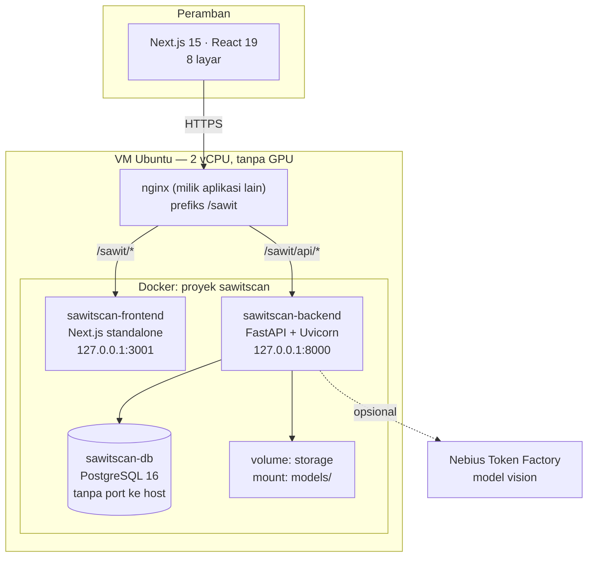
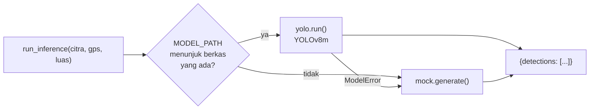
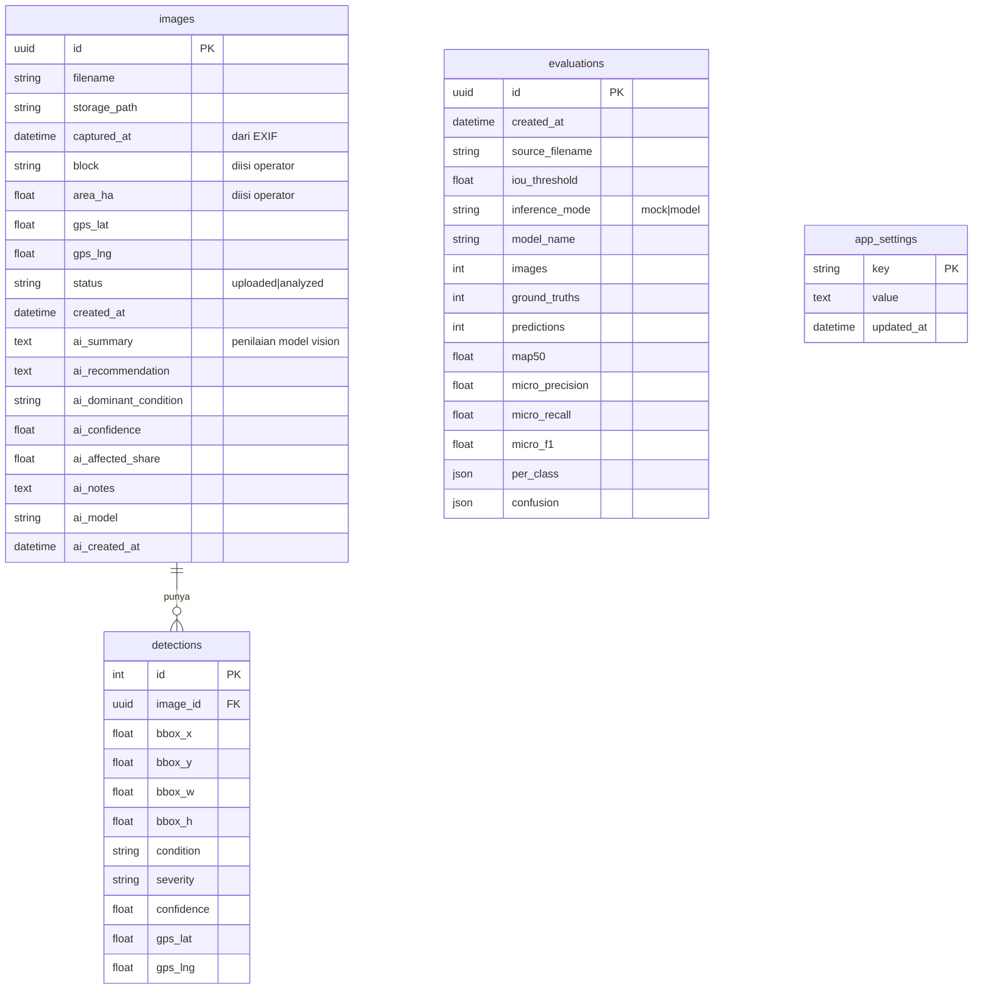
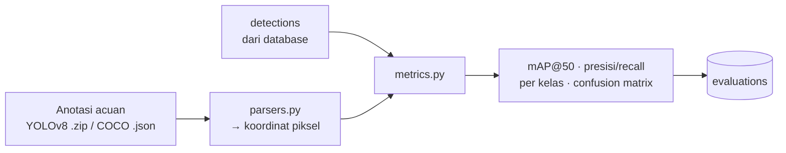
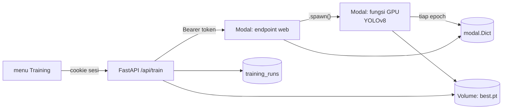
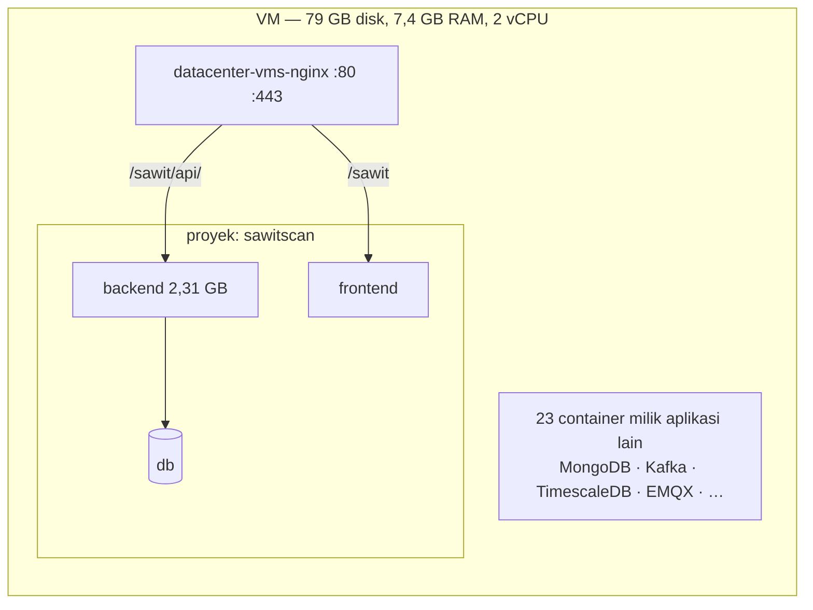

# Arsitektur SawitScan AI

Dokumen rancangan sistem: apa yang dibangun, bagaimana bagian-bagiannya
terhubung, **mengapa** dirancang begitu, dan apa batasnya.

Seluruh angka di dokumen ini hasil pengukuran pada sistem yang berjalan, bukan
perkiraan. Tanggal: 6 Agustus 2026 · 173 tes otomatis · terpasang di
`43.157.197.253/sawit`.

---

## 1. Ruang lingkup

SawitScan AI adalah **lapisan inference & pelaporan** di atas model AI yang
dilatih terpisah. Sistem menerima citra UAV, menjalankan deteksi kondisi tanaman
kelapa sawit, lalu menyajikan hasilnya sebagai visualisasi, agregat, dan laporan.

**Di dalam cakupan**

| | |
| --- | --- |
| Unggah citra | Single & batch, validasi format, **label per berkas**, ekstraksi waktu/GPS dari EXIF |
| Inference | Menjalankan model final (`.pt`) yang diserahkan klien |
| Visualisasi | Bounding box, label kondisi, keparahan, confidence |
| Agregasi | Dashboard lintas citra, pencarian berdasarkan label |
| Riwayat | Penyimpanan hasil, dapat dibuka kembali |
| Laporan | Ekspor PDF & CSV |
| Evaluasi | mAP@50, presisi/recall per kelas, confusion matrix |
| Analisis AI | Penilaian tingkat citra oleh model vision eksternal |

**Di luar cakupan** — pelatihan dan pelabelan model. Itu dikerjakan klien di
Roboflow dan notebook. Sistem hanya menerima berkas model final.

---

## 2. Gambaran menyeluruh



### Mengapa dipisah begini

**Backend Python.** Model berbasis PyTorch berjalan native, tanpa jembatan bahasa.

**PostgreSQL tidak mem-publish port ke host.** VM ini menjalankan 23 container
milik aplikasi lain, termasuk PostgreSQL/TimescaleDB di port 5432. Menyalakan
port kedua akan bentrok; jaringan internal Docker menghilangkan persoalan itu.

**Backend & frontend hanya mendengarkan `127.0.0.1`.** Yang menghadap internet
cukup nginx yang sudah ada. Tidak ada port baru yang terbuka ke publik.

**Prefiks `/sawit`.** nginx milik aplikasi lain memakai `server_name _`
(tanpa domain) dan `/api/` sudah terpakai. Karena itu SawitScan mengambil
prefiks sendiri, dan Next.js dijalankan dengan `basePath`.

**`proxy_pass` memakai variabel + resolver Docker, bukan `upstream` statis.**
Kalau container SawitScan mati, nginx tetap dapat start dan hanya `/sawit` yang
gagal. Dengan `upstream` statis, nginx menolak start dan **situs klien ikut mati**.

---

## 3. Backend

```
app/
  main.py            aplikasi FastAPI, CORS, /health (kueri DB nyata)
  config.py          Settings dari environment; resolusi MODEL_PATH
  db.py              engine & session SQLAlchemy
  errors.py          bentuk galat seragam, pesan Bahasa Indonesia
  models.py          4 tabel ORM
  schemas.py         kontrak JSON (Pydantic)
  mappers.py         ORM → skema, satu tempat
  routers/           upload · results · dashboard · export · evaluation · settings
  services/          exif · export (PDF/CSV) · app_settings
  inference/         engine · yolo · mock · nebius · conditions
  evaluation/        metrics · parsers
```

### Lapisan inference — jantung maintainability

Seluruh aplikasi memanggil **satu fungsi**: `run_inference()` di
`inference/engine.py`. Tidak ada modul lain yang tahu model apa yang dipakai.



**Mengapa ada mock sama sekali.** Aplikasi dibangun berbulan sebelum model
tersedia. Mock membuat seluruh alur — unggah, dashboard, laporan — dapat
dikembangkan dan diuji tanpa menunggu model. Sekarang ia berperan sebagai
cadangan: satu berkas model rusak tidak melumpuhkan aplikasi.

**Mengapa kegagalan model turun ke mock, bukan menggagalkan permintaan.**
Kegagalan dicatat di log, dan `GET /api/system` melaporkan `model_error`.
Aplikasi tetap dapat dipakai sementara masalahnya diperbaiki.

**Nama kelas dibaca dari `model.names`, tidak diasumsikan.** Model ini memakai
urutan alfabetis (`dead, healthy, small, yellow`), berbeda dari urutan di
dokumentasi dataset. Mengasumsikan urutan akan menukar seluruh label secara diam-diam.

### Dua nilai yang BUKAN keluaran model

Ini penting untuk pelaporan ilmiah, dan ditandai di API agar tidak tersamar.

**Keparahan** — model adalah detektor 4 kelas tanpa kepala keparahan, dan dataset
tidak memuat labelnya. Nilainya diturunkan dari aturan tetap di `yolo.py`:

| Kelas | Keparahan | Alasan |
| --- | --- | --- |
| `healthy` | sehat | — |
| `yellow` | ringan | defisiensi hara umumnya masih dapat dipulihkan |
| `small` | sedang | pertumbuhan terhambat bersifat kronis |
| `dead` | berat | tanaman mati adalah kasus terparah |

`GET /api/system` melaporkan `severity_source: "rule"`.

**Koordinat per pohon** — tidak lagi dihitung. Mengubah posisi piksel menjadi
lintang/bujur memerlukan skala tanah yang tidak ada di dalam citra; nilainya dulu
diturunkan dari luas area yang diisi operator. Sejak konsep bergeser ke
pemindaian citra berlabel, luas area tidak lagi diminta, sehingga skala itu tidak
dapat diketahui dan koordinat per pohon dibiarkan kosong.

Koordinat **tingkat citra** dari EXIF tetap dibaca dan disimpan. Kolomnya
dipertahankan utuh: menghidupkan kembali fitur peta kelak tidak memerlukan
pemulihan data apa pun.

---

## 4. Model data



Enam migrasi Alembic, semuanya teruji naik dan turun:

| | |
| --- | --- |
| `0001` | skema awal: images, detections |
| `0002` | `disease` → `condition` (istilah, lihat §8) |
| `0003` | blok kebun & luas area |
| `0004` | penilaian AI tingkat citra |
| `0005` | tabel evaluations |
| `0006` | app_settings (kunci API dari layar Pengaturan) |
| `0007` | users, sessions, training_runs |
| `0008` | label per citra (peran blok kebun digantikan) |

**`evaluations` menyimpan `inference_mode`.** Angka yang dihasilkan mock tidak
akan pernah tertukar dengan angka model — layar Evaluasi menandai tiap baris dan
menolak menampilkan hasil mock tanpa peringatan.

---

## 5. Alur data

```mermaid
sequenceDiagram
    actor O as Operator
    participant FE as Frontend
    participant BE as Backend
    participant M as YOLOv8m
    participant DB as PostgreSQL

    O->>FE: pilih citra + beri label tiap berkas
    FE->>BE: POST /api/upload
    BE->>BE: validasi format & ukuran
    BE->>BE: baca EXIF (GPS, waktu)
    Note over BE: EXIF menang; isian manual<br/>hanya menambal bila kosong
    BE->>DB: simpan images (status: uploaded)
    BE-->>FE: daftar image_id

    FE->>BE: POST /api/analyze/{id}
    BE->>M: predict(citra)
    M-->>BE: kotak piksel + kelas + confidence
    BE->>BE: keparahan (aturan) · piksel→GPS (luas area)
    BE->>DB: simpan detections, status: analyzed
    BE-->>FE: hasil sesuai kontrak JSON

    O->>FE: buka Dashboard / Riwayat / Laporan
    FE->>BE: GET /api/dashboard?block=…
    BE->>DB: agregat
    BE-->>FE: KPI, distribusi, daftar citra
```

### Kontrak JSON

Didefinisikan di `CLAUDE.md`, dicerminkan di `app/schemas.py` dan
`frontend/src/types/detection.ts`. **Ketiganya harus berubah bersamaan.**

```json
{
  "image_id": "uuid",
  "filename": "DJI_0742.JPG",
  "captured_at": "2026-07-21T08:12:00Z",
  "block": "A-3",
  "area_ha": 4.5,
  "gps": { "lat": -0.78912, "lng": 101.41233 },
  "summary": { "total": 147, "healthy": 74, "infected": 73, "severe": 0 },
  "detections": [
    {
      "id": 1,
      "bbox": [x, y, w, h],
      "condition": "Menguning",
      "severity": "ringan",
      "confidence": 0.79,
      "gps": { "lat": -0.78915, "lng": 101.41240 }
    }
  ],
  "ai": null
}
```

`run_inference()` hanya mengembalikan bagian yang berasal dari model
(`detections`). Identitas citra dan `summary` dirakit pemanggil — model tidak
mengetahui data itu.

---

## 6. API

| Metode | Rute | Keterangan |
| --- | --- | --- |
| `POST` | `/api/upload` | Batch citra + blok, luas, koordinat manual |
| `POST` | `/api/analyze/{id}` | Jalankan inference; analisis ulang menimpa |
| `POST` | `/api/analyze/{id}/ai` | Penilaian model vision (opsional) |
| `GET` | `/api/results` | Riwayat, terbaru dulu |
| `GET` | `/api/results/{id}` | Satu hasil lengkap |
| `GET` | `/api/images/{id}/file` | Berkas citra asli |
| `GET` | `/api/map?block=` | Deteksi ber-GPS lintas citra |
| `GET` | `/api/dashboard?block=` | Agregat |
| `GET` | `/api/blocks` | Daftar blok + jumlah citra/pohon/luas |
| `GET` | `/api/conditions` | Acuan kondisi: ciri, interpretasi, tindakan |
| `GET` | `/api/system` | Mode inference, galat mesin, status AI |
| `POST` | `/api/evaluate` | Evaluasi terhadap anotasi acuan |
| `GET` | `/api/evaluations` | Riwayat evaluasi |
| `GET` | `/api/results/{id}/export.{pdf,csv}` | Unduh laporan |
| `PUT` `DELETE` | `/api/settings/ai` | Kunci API (tulis saja, tak pernah dibaca) |
| `PUT` | `/api/settings/ai/model` | Ganti model tanpa menyentuh kunci |
| `GET` | `/health` | Kueri DB nyata, bukan sekadar "ok" |

### Penanganan galat

Setiap kegagalan berbentuk sama — `{"detail": "<pesan>"}` — berbahasa Indonesia
dan dapat ditindaklanjuti operator. Stack trace dan galat validasi Pydantic masuk
log, tidak ke layar.

| Kode | Kapan |
| --- | --- |
| `400` | Format tak didukung · koordinat tak berpasangan · anotasi rusak |
| `404` | Citra tidak ditemukan |
| `409` | Citra belum dianalisis |
| `410` | Berkas citra hilang dari penyimpanan |
| `413` | Melebihi `MAX_UPLOAD_MB` |
| `422` | Permintaan tidak valid |
| `502` | Penyedia AI gagal |
| `503` | Database tak terjangkau · AI belum dikonfigurasi |

---

## 7. Frontend

Next.js 15 App Router, React 19, Tailwind 4. Delapan layar:

| Rute | Isi |
| --- | --- |
| `/` | Dashboard: KPI, pencarian label, galeri citra, panel hasil, distribusi, antrian |
| `/unggah` | Unggah + label per berkas, dengan pratinjau |
| `/proses` | Animasi pipeline saat analisis berjalan |
| `/hasil/{id}` | Bbox di atas citra, panel temuan, kartu Analisis AI |
| `/riwayat` | Daftar citra |
| `/laporan` | Tabel unduhan PDF/CSV |
| `/evaluasi` | mAP, metrik per kelas, confusion matrix |
| `/pengaturan` | Kunci API, acuan kondisi, status sistem |

**Seluruh panggilan REST terpusat di `lib/api.ts`.** Tidak ada komponen yang
memanggil `fetch()` langsung — mengganti alamat API atau menambah header cukup
di satu berkas.

**Animasi dinyatakan di CSS global, bukan di tiap komponen.** Kelas `.muncul`,
`.kerangka`, `.titik-sibuk`, dan `.kartu-tekan` dipakai bersama seluruh layar,
sehingga geraknya konsisten dan seluruhnya dapat dimatikan sekaligus lewat
`prefers-reduced-motion`. Animasi di sini bertugas menjelaskan apa yang sedang
terjadi — apa yang baru muncul, apa yang sedang dikerjakan — bukan menghias.

**Kerangka isi, bukan spinner, selama data dimuat.** Bentuknya sudah menyerupai
isi yang akan datang, sehingga tata letak tidak melompat saat data tiba.

---

## 8. Istilah: kondisi, bukan penyakit

Dataset klien (`heras-workspace/oil-palm-central-kalimantan`, 1.007 citra) memuat
**4 kelas kondisi tanaman**, bukan nama penyakit:

| Kelas | Label UI | Ciri dari citra atas | Interpretasi | Tindakan |
| --- | --- | --- | --- | --- |
| `healthy` | Sehat | Tajuk hijau rapat, pelepah normal | Tanaman sehat | Tidak ada tindakan |
| `yellow` | Menguning | Tajuk kuning atau hijau pucat | Dugaan defisiensi nutrisi | Periksa unsur hara, pemupukan susulan (N/Mg/K) |
| `dead` | Mati/stres | Tajuk mengering, cokelat | Pelepah mati atau stres berat | Pemangkasan atau inspeksi lapangan |
| `small` | Kerdil | Tajuk lebih kecil dari sekitarnya | Pertumbuhan terhambat | Review pemupukan, evaluasi kondisi tanah |

Daftar penyakit di proposal (Ganoderma, karat daun, bercak daun Curvularia,
defisiensi hara) **tidak ada di dataset**. Model yang dilatih atasnya tidak akan
pernah mengeluarkan nama-nama itu. Karena itu istilah di database, API, dan UI
memakai `condition` — migrasi `0002` yang melakukan penggantian nama.

Tabel di atas tersimpan di `inference/conditions.py`, disajikan lewat
`GET /api/conditions`, dan muncul sebagai bagian "Rekomendasi tindakan" pada
laporan PDF.

---

## 9. Subsistem evaluasi

Menjawab kebutuhan pelaporan ilmiah: sistem dapat **mengukur dirinya sendiri**.



Dua keputusan yang menentukan kebenaran angkanya:

**Pencocokan agnostik kelas lebih dulu.** Kotak yang tepat tapi kelasnya keliru
muncul sebagai sel di luar diagonal confusion matrix — bukan sebagai objek yang
"tidak terdeteksi". Tanpa itu, kesalahan klasifikasi dan kegagalan deteksi
tercampur dan tidak dapat dibedakan.

**Hanya citra yang punya anotasi yang ikut dihitung**, dan **satu anotasi hanya
dipasangkan dengan satu citra**. Keduanya ditemukan lewat kegagalan nyata:
menyertakan citra tanpa anotasi menjadikan seluruh deteksinya positif palsu;
berkas bernama sama yang diunggah dua kali membuat 705 deteksi terbaca 1.410 dan
presisi anjlok tanpa sebab.

`metrics.py` murni — tanpa database, berkas, maupun jaringan — dengan 20 tes
tersendiri, termasuk kasus AP yang dihitung tangan.

---

## 9b. Training model (Modal)

Melatih ulang model dari dalam aplikasi. VM produksi tidak punya GPU, jadi
training berjalan di Modal dan aplikasi bertindak sebagai perantara.



Empat keputusan yang menentukan:

**Token Modal berhenti di backend.** Peramban tidak pernah melihatnya. Satu
permintaan training berarti biaya GPU nyata, jadi tokennya diperlakukan seperti
kunci API — dan ada tes yang memastikan ia tidak pernah muncul di respons.

**Progres ditulis lewat callback `on_fit_epoch_end`, bukan dibaca dari stdout.**
stdout container GPU tidak terjangkau endpoint web yang berjalan di container
lain, dan formatnya berubah antar versi ultralytics. Dipilih `on_fit_epoch_end`
dan bukan `on_train_epoch_end` karena ia berjalan **setelah** validasi — pada
callback yang lain, mAP yang tersedia masih milik epoch sebelumnya.

**Riwayat disimpan di PostgreSQL, progres di modal.Dict.** Dict cepat dibaca
tetapi tidak permanen; riwayat training adalah bagian catatan penelitian yang
harus bertahan melewati restart. Karena itu angka akhir disalin ke
`training_runs` begitu training selesai.

**Bobot hasil training ditulis ke volume storage**, bukan ke `backend/models/`
yang di-mount read-only — supaya model yang diserahkan klien tidak dapat
tertimpa dari aplikasi. Penunjuk model aktif ada di `app_settings`, sehingga
berganti model tidak memerlukan restart.

Selengkapnya: [`TRAINING.md`](TRAINING.md).

## 10. Lapisan analisis AI (opsional)

Penilaian **tingkat citra** oleh model vision eksternal, berdampingan dengan
deteksi per pohon.

Model vision umum tidak dapat melokalisasi puluhan pohon satu per satu; itu tetap
pekerjaan YOLOv8. Yang dinilainya adalah citra secara utuh: kondisi dominan,
perkiraan bagian bermasalah, ringkasan, dan saran tindakan.

**Selisih perkiraannya dengan hasil deteksi dihitung dan ditampilkan.** Selisih
≥20 poin persen ditandai *"citra ini layak diperiksa manual"*. Menampilkan
ketidaksepakatan lebih jujur daripada memilih satu angka.

Pengamanan: label di luar keempat kelas **ditolak** (model kadang mengarang
"Ganoderma"), nilai di luar 0–1 dijepit, kegagalan tidak merusak deteksi yang
tersimpan, dan endpoint terpisah agar panggilan lambat tidak menahan analisis.

**Kunci API diisi lewat layar Pengaturan**, tersimpan di `app_settings`,
berlaku seketika tanpa restart. Kunci hanya bisa dikirim — API mengembalikan
status dan empat karakter terakhir sebagai penanda, tidak pernah nilainya.

---

## 11. Deployment



Prinsip isolasi — VM ini bukan milik SawitScan sendiri:

| Hal | Cara menghindar |
| --- | --- |
| Nama container/volume/jaringan | Semua berawalan `sawitscan` |
| Port PostgreSQL | Tidak di-publish; hanya jaringan internal |
| Port 8000/3001 | Bind ke `127.0.0.1`, dapat diganti lewat `.env` |
| nginx | Menambah blok `location`, bukan mengganti konfigurasi |
| Berkas model | Di-mount, bukan disalin ke image — ganti model tanpa build ulang |

**`nginx -t` dijalankan sebelum reload**, dan skripnya mengembalikan cadangan
bila uji itu gagal. `reload` tidak memutus koneksi berjalan.

### Konfigurasi

Seluruh kredensial lewat environment atau layar Pengaturan; tidak ada yang
di-hardcode maupun masuk repositori.

| Variabel | Keterangan |
| --- | --- |
| `DATABASE_URL` | Wajib diganti di produksi |
| `CORS_ORIGINS` | Wajib diganti di produksi |
| `MODEL_PATH` | mis. `models/best.pt`; kosong = mock |
| `MAX_UPLOAD_MB` | Batas ukuran satu citra (50) |
| `NEBIUS_API_KEY` | Dapat diisi lewat layar Pengaturan |
| `NEBIUS_MODEL` | Model vision |

`MODEL_PATH` relatif diselesaikan terhadap `backend/`, bukan direktori kerja —
uvicorn, pytest, dan container berjalan dari direktori yang berbeda.

---

## 12. Kinerja terukur

Diukur pada VM produksi, 2 vCPU tanpa GPU.

| Operasi | Waktu |
| --- | --- |
| Inference pada ubin dataset (512 px) | **0,83 – 1,16 s** |
| Inference bingkai UAV penuh, CPU (±60 ubin) | **47 – 52 s** |
| Inference bingkai UAV penuh, GPU Modal | jauh lebih cepat; belum diukur di sini |
| Muat model (sekali per container) | 5,4 s |
| Ambil hasil / dashboard | 9 – 10 ms |
| Ekspor PDF | 20 ms |
| Muat halaman | 8 ms |
| Analisis AI (Nebius) | beberapa detik |

Pemakaian memori ketiga container: **±153 MB** saat menganggur.

Ekstrapolasi 3.000 citra ≈ **42 menit** berturut-turut. GPU tidak diperlukan pada
skala ini. Inference masih **sinkron**; untuk batch besar yang berjalan bersamaan
dengan pemakaian lain, antrean (Celery/RQ) menjadi perlu.

---

## 13. Hasil evaluasi model

176 citra split `test` — **tidak pernah dilihat model saat pelatihan**.

| | |
| --- | --- |
| mAP@50 | **0,555** |
| Presisi (mikro) | 0,656 |
| Recall (mikro) | 0,861 |
| F1 (mikro) | 0,745 |
| Cakupan | 10.813 anotasi acuan · 14.174 prediksi · IoU ≥ 0,5 |

| Kelas | Acuan | Presisi | Recall | AP |
| --- | --- | --- | --- | --- |
| Kerdil | 1.486 | 77,4% | 90,6% | 73,8% |
| Sehat | 6.881 | 65,4% | 89,3% | 59,4% |
| Menguning | 2.411 | 59,7% | 74,2% | 46,8% |
| Mati/stres | 35 | 66,7% | 62,9% | 41,9% |

Recall tinggi dengan presisi sedang berarti model **cenderung mendeteksi
berlebih** — 14.174 prediksi untuk 10.813 objek. Ambang keyakinan (0,25) adalah
variabel yang dapat disetel untuk menukar recall dengan presisi.

Kelas `Mati/stres` hanya punya 35 contoh di split uji; AP-nya tidak dapat
diandalkan karena ketimpangan kelas.

**Catatan metodologis:** angka ini dihitung evaluator yang ditulis untuk sistem
ini, bukan `yolo val` bawaan ultralytics. Metodenya standar (IoU 0,5, AP
interpolasi seluruh titik) dan diuji terpisah, tetapi untuk pelaporan ilmiah
sebaiknya dicek silang dengan alat resmi.

---

## 14. Pengujian

173 tes otomatis, seluruhnya berjalan tanpa jaringan, tanpa GPU, tanpa berkas
model, dan tanpa kunci API.

| Cakupan | Yang dijaga |
| --- | --- |
| Metrik evaluasi | 20 tes; AP dihitung tangan, bukan disalin dari keluaran program |
| Pembaca anotasi | YOLO & COCO, format rusak, kelas asing |
| Lapisan YOLO | Model ditiru; pemetaan keluaran, aturan keparahan, georeferensi |
| Lapisan AI | HTTP ditiru; kunci tidak bocor ke payload maupun respons |
| Dependensi produksi | Membaca filter Dockerfile, memastikan tiap impor `app/` ada di image |
| Alur API | Unggah, analisis, blok, ekspor, evaluasi, galat |

Uji terhadap PostgreSQL sungguhan: `python scripts/check_postgres.py` —
menyalakan PostgreSQL sementara sendiri, tanpa Docker.

Tes dependensi produksi lahir dari kegagalan nyata: `httpx` tersaring dari image
sehingga backend gagal start setelah deploy, sementara pengujian lokal tetap
hijau karena virtualenv dev memuat semuanya.

---

## 15. Batasan yang diketahui

**Satu tingkat pengguna saja.** Autentikasi sudah ada (sesi + scrypt), tetapi
semua akun punya hak yang sama: siapa pun yang dapat masuk dapat memicu training
GPU berbayar dan mengganti kunci API. Belum ada peran atau audit per pengguna.

**Keparahan tidak berdasar data.** Dataset tidak memuat labelnya; nilainya
berasal dari aturan tetap. Ini memengaruhi `summary.severe` dan kartu
"Kasus Berat".

**Tidak ada pemetaan spasial.** Konsepnya kini pemindaian citra berlabel:
identitas citra berasal dari nama yang diberikan pengunggah, bukan dari
koordinat. Kolom GPS dan blok masih ada di database beserta datanya, tetapi tidak
diisi maupun ditampilkan lagi.

**Tiling belum ada.** Proposal menyebut pemotongan citra bila diperlukan. Sistem
saat ini menganggap satu berkas = satu bingkai UAV. Bila citra berupa
orthomosaic seluruh kebun, tiling perlu dibangun.

**Inference sinkron.** Cukup untuk skala saat ini; batch besar memerlukan antrean.

**Swin Transformer + MTL belum ada.** Yang terpasang detektor YOLOv8 4 kelas.
Kepala klasifikasi terpisah untuk jenis dan keparahan belum menjadi bagian sistem.

---

## 16. Rujukan

| Dokumen | Isi |
| --- | --- |
| [`SWAP_MODEL.md`](SWAP_MODEL.md) | Cara mengganti model; ketidakcocokan dataset vs proposal |
| [`TRAINING.md`](TRAINING.md) | Menyiapkan mesin training Modal & memakai menu Training |
| [`AUDIT_PROPOSAL.md`](AUDIT_PROPOSAL.md) | Pemeriksaan butir demi butir proposal |
| [`DEPLOY.md`](DEPLOY.md) | Pemasangan di VM bersama aplikasi lain |
| [`PROMPT_PRESENTASI.md`](PROMPT_PRESENTASI.md) | Bahan presentasi + screenshot |
| [`../SPEC.md`](../SPEC.md) | Spesifikasi teknis & urutan pengerjaan |
| [`../CLAUDE.md`](../CLAUDE.md) | Kontrak JSON & konvensi proyek |
