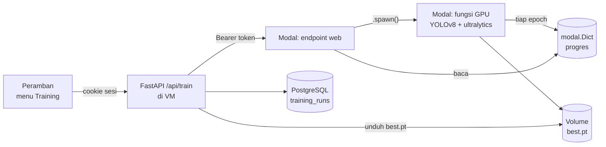

# Training model dari aplikasi

Melatih ulang model deteksi tanpa membuka notebook: unggah dataset lewat menu
**Training**, pantau progresnya per epoch, lalu tekan **Jadikan Model Aktif**.

Aplikasi tidak melatih apa pun sendiri — VM produksi tidak punya GPU. Training
berjalan di [Modal](https://modal.com), dan aplikasi bertindak sebagai perantara.



**Token Modal tidak pernah sampai ke peramban.** Peramban berbicara dengan
FastAPI memakai cookie sesi; FastAPI yang memegang token dan berbicara dengan
Modal. Satu permintaan training berarti biaya GPU, jadi tokennya diperlakukan
seperti kunci API.

---

## 1. Menyiapkan mesin training di Modal

Dijalankan sekali. Perlu akun Modal — perintah di bawah dijalankan di komputer
Anda, bukan di VM.

```bash
pip install modal && modal setup
```

Buat secret berisi token. Bangkitkan nilai acak dan simpan di pengelola kata
sandi Anda — nilai yang sama nanti dipasang di VM:

```bash
python -c "import secrets; print(secrets.token_urlsafe(32))"
```

```bash
modal secret create sawitscan-training-token SAWITSCAN_TRAINING_TOKEN=<token-yang-tadi>
```

Lalu deploy:

```bash
modal deploy training_engine/sawitscan_training.py
```

Modal mencetak URL endpoint, berbentuk
`https://<workspace>--sawitscan-training-web.modal.run`. Catat URL itu.

Uji dengan cepat — tanpa token harus ditolak:

```bash
curl -s -o /dev/null -w '%{http_code}\n' https://<workspace>--sawitscan-training-web.modal.run/train/x/status
```

Jawaban `401` berarti perlindungannya bekerja.

### Mengganti jenis GPU

Bawaan **L4**, memadai untuk YOLOv8m. Untuk mengubahnya, sunting `GPU_TYPE` di
`training_engine/sawitscan_training.py` (`T4` lebih murah, `A10G` lebih cepat),
lalu deploy ulang.

---

## 2. Menghubungkan aplikasi ke mesin itu

Di VM, tambahkan ke berkas `.env` di sebelah `docker-compose.prod.yml`:

```
MODAL_TRAINING_URL=https://<workspace>--sawitscan-training-web.modal.run
MODAL_TRAINING_TOKEN=<token yang sama persis dengan secret Modal>
```

Lalu:

```bash
docker compose -p sawitscan -f docker-compose.prod.yml up -d backend
```

Selama kedua nilai itu kosong, menu Training tetap ada tetapi melapor "mesin
belum dikonfigurasi" — sisa aplikasi berjalan penuh.

---

## 3. Akun pengguna

Seluruh API kini tertutup. **Selama belum ada akun, semua permintaan ditolak**
dengan pesan yang menjelaskan cara membuatnya — aplikasi tidak dibiarkan terbuka
hanya karena pengaturannya belum selesai.

```bash
docker compose -p sawitscan -f docker-compose.prod.yml exec backend python scripts/create_user.py
```

Kata sandi diminta lewat prompt: tidak tampil di layar, tidak masuk riwayat
shell, dan tidak pernah menjadi argumen perintah yang terlihat lewat `ps`.

Yang tersimpan hanya turunan scrypt-nya. Kata sandi yang hilang tidak dapat
dipulihkan — jalankan skrip yang sama untuk menggantinya.

---

## 4. Memakainya

1. Buka menu **Training**.
2. Pilih dataset `.zip` format YOLOv8 — berisi `data.yaml` dan folder
   `train/`, `valid/`. Ekspor Roboflow "YOLOv8" sudah sesuai.
3. Isi jumlah epoch, model dasar, dan nama versi.
4. **Mulai Training**. Halaman menampilkan progres per epoch: batang epoch,
   grafik `box/cls/dfl loss`, dan grafik `mAP50` / `mAP50-95`.
5. Setelah selesai, tekan **Jadikan Model Aktif**.

Halaman boleh ditutup — progres tetap tercatat, dan membukanya lagi akan
menyambung kembali ke training yang sedang berjalan.

### Yang terjadi saat "Jadikan Model Aktif" ditekan

`best.pt` diunduh dari Modal ke volume storage backend, lalu penunjuk model
dicatat di tabel `app_settings`. Berlaku pada **analisis berikutnya**, tanpa
restart container.

Citra yang sudah dianalisis tidak ikut berubah. Untuk menyamakannya dengan model
baru, jalankan analisis ulang pada citra tersebut.

Bobot ditulis ke volume storage, bukan ke `backend/models/` — folder itu
di-mount read-only supaya model yang diserahkan klien tidak dapat tertimpa dari
aplikasi.

---

## Catatan operasional

**Biaya.** Tiap training memakai GPU berbayar per detik. Formulirnya membatasi
epoch pada 300 dan dataset pada 2 GB, tetapi tidak ada batas jumlah training —
batas sebenarnya adalah siapa yang punya akun di aplikasi ini.

**Kelas dataset harus tetap empat.** Model yang dilatih dengan jumlah atau nama
kelas berbeda akan menghasilkan label yang tidak dikenali lapisan inference, dan
deteksinya dibuang diam-diam. Lihat [`SWAP_MODEL.md`](SWAP_MODEL.md).

**Keparahan tetap berbasis aturan.** Training tidak mengubah hal itu — dataset
tidak memuat label keparahan. Lihat [`ARSITEKTUR.md`](ARSITEKTUR.md) §3.

**Evaluasi tetap terpisah.** Angka mAP dari layar Training dihitung ultralytics
pada split `valid` milik dataset. Untuk angka yang dilaporkan dalam disertasi,
pakai menu **Evaluasi** terhadap split `test` — itu yang mengukur model
sebagaimana benar-benar dipakai aplikasi.

---

## Bila bermasalah

| Gejala | Sebab yang paling sering |
| --- | --- |
| "Mesin training tidak dapat dihubungi" | Modal app belum di-deploy, atau URL salah |
| "Mesin training menolak token" | Nilai `MODAL_TRAINING_TOKEN` berbeda dengan secret Modal |
| Status `failed`, pesan `CUDA out of memory` | Turunkan `batch`, atau pakai model dasar yang lebih kecil |
| Status `failed`, `data.yaml tidak ditemukan` | Zip bukan ekspor format YOLOv8 |
| Progres berhenti di epoch 0 selama beberapa menit | Wajar — Modal sedang menyalakan container GPU dan mengunduh bobot dasar |

Log mesin training:

```bash
modal app logs sawitscan-training
```
